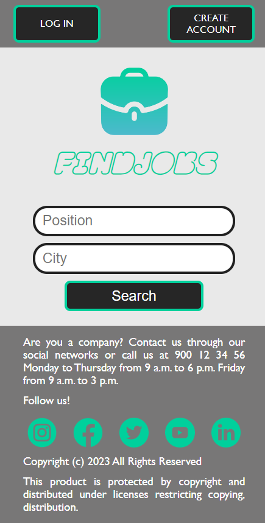
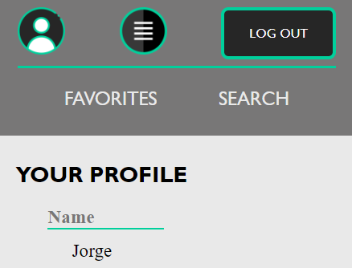
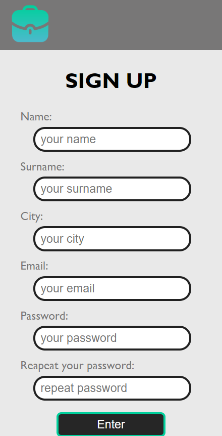
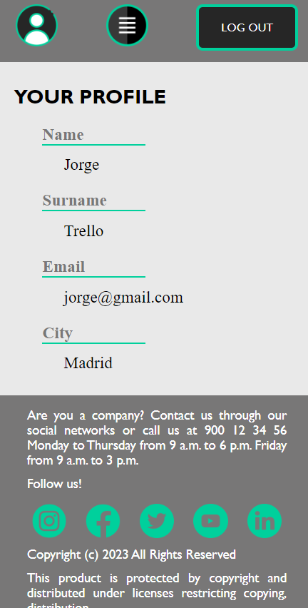

# FINDJOBS  -  PROYECTO BACKEND (FULLSTACK BOOTCAMP THE BRIDGE)

Esta es una aplicación web creada para aquellos que quieren encontrar su primer empleo en el mundo de la tecnología. Permite a los usuarios buscar a través de scrapin de dos páginas externas varios resultados acorde con su búsqueda con puesto de trabajo y provincia.

## Tecnologías Utilizadas.
- MongoDB
- PostgreSQL en ElephantSQL
- Docker
- Web scraping con Puppeteer
- Node.js con Express
- JSDoc
- Morgan
- Pug
- HTML
- CSS
- JavaScript
- Despliegue en Render

## Funcionalidades Implementadas.
- Operaciones CRUD en bases de datos SQL (información de usuarios y ofertas guardadas por usuario) y bases de datos NoSQL para las ofertas de empleo administradas por el administrador.
- Búsqueda y visualización de ofertas de empleo obtenidas mediante web scraping de dos sitios web diferentes, además de las ofertas de empleo creadas por el administrador y almacenadas en la base de datos de Atlas de MongoDB.
- Funcionalidad de registro, inicio de sesión y cierre de sesión para los usuarios, con uso de cookies y tokens, y rutas protegidas.
- Menú hamburguesa para navegar entre las diferentes vistas de la aplicación.
- Vista privada para el administrador, donde puede crear y eliminar ofertas de empleo almacenadas en Atlas.

## Estructura de la Aplicación.

- **Inicio**: Página principal desde donde se genera la interacción inicial. Incluye un formulario de búsqueda que lleva a la vista de resultados.

- **Resultados**: Esta vista muestra las ofertas de empleo que coinciden con la búsqueda, obtenidas a través del web scraping, y las ofertas de empleo provenientes de la base de datos de Atlas de MongoDB. Si un usuario ha iniciado sesión, se muestra un botón "Favoritos" en cada tarjeta de oferta, y las ofertas seleccionadas se guardan en la base de datos SQL.

- **Autenticación**: La barra de navegación contiene botones para crear una cuenta e iniciar sesión. Si un usuario no está registrado, se le anima a crear una cuenta. Al iniciar sesión, los usuarios son redirigidos a su página de perfil.

- **Perfil de Usuario**: Los usuarios pueden ver su información obtenida de la base de datos SQL. A través de la navegación del menú y los diferentes iconos de la barra de navegación, los usuarios pueden acceder a la página de favoritos.

- **Favoritos**: En esta página se muestran las tarjetas de las ofertas de empleo seleccionadas por el usuario en la vista de resultados.

- **Vista del Administrador**: Es una vista privada a la que solo pueden acceder los usuarios con rol de administrador al iniciar sesión. El rol de administrador se define en la base de datos SQL. En esta vista, el administrador puede crear y eliminar ofertas de empleo que se almacenan en Atlas.

## Estructura del proyecto.
- **Parte Frontend**:
  - Carpeta `public`: Archivo `CSS` para los estilos y `script.js` para las funcionalidades del frontend, como botones o menú. También contiene la carpeta `assets` con iconos e imágenes.
- **Parte Backend**:
  - Archivo `app.js`: Configuración general del proyecto.
  - Carpetas de `Controladores`, `Queries` y `Models`: Para el CRUD con las bases de datos de MongoDB y SQL.
  - Carpeta `Middlewares`: Para controlar errores de rutas y verificar el token.
  - Carpeta `Rutas`: Definición de las rutas de las vistas y del CRUD.
  - Carpeta `Utils`: Configuración de conexión con las bases de datos, expresiones regulares, validación de formularios y scraping.
  - Views de `Pug`: Vistas HTML generadas por Pug para renderizar las páginas.
  - Documento `queries.sql`: Definición de la creación de tablas en SQL.
  - Carpeta `jsondoc`: Documentación de código en formato JSON.

## Tareas Pendientes a implementar en futuras versiones.
- Recuperación de contraseña a través de correo electrónico.
- Autenticación con Google.
- Pruebas (Testing).
- Borrar ofertas favoritas por parte del usuario.
- Editar ofertas en la vista del administrador.
- Crear, borrar y editar usuarios por parte del administrador.
- Mostrar nombre y foto de perfil del usuario en la barra de navegación (navbar).
- Agregar spin para esperas durante búsquedas.

Espero que esto sea útil para tu repositorio de GitHub.

